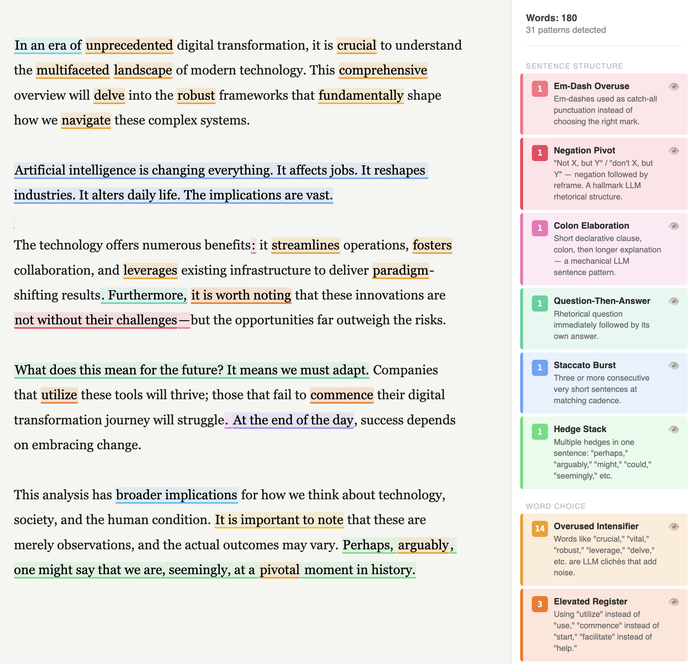

#  Slop Cop

A browser-based editor that detects the rhetorical and structural tells of LLM-generated prose — and highlights them in real time.

**[https://awnist.com/slop-cop](https://awnist.com/slop-cop)**



## Why this exists

LLMs trained on human feedback develop characteristic writing tics. They hedge reflexively, open with throat-clearing, reach for the same dozen intensifiers, structure arguments as `not X, but Y`, and inflate ordinary points to world-historical significance. These patterns are learnable and detectable. Slop Cop makes them visible so writers can decide whether to keep or cut them.

This is not a plagiarism detector. The question isn't whether text was written by an AI — it's whether the text *reads* like it was. That's the thing that actually matters.

## How it works

Detection runs in two tiers:

**Client-side (instant):** 36 rules implemented as regex and structural analysis. Fire on every keystroke after a 350ms debounce. No API key needed.

**Semantic (optional):** Two parallel calls to the configured LLM (Anthropic, OpenAI, or a local model), triggered manually:

- *Fast pass* — Claude Haiku (~5s): sentence and paragraph-level patterns that require language understanding (sycophantic framing, unnecessary elaboration, etc.). Large documents are automatically split into overlapping chunks and analyzed in parallel for better coverage.
- *Deep pass* — Claude Sonnet (~15s): document-level patterns only visible at scale (dead metaphor repetition, one-point dilution, fractal summaries)

API calls go directly from your browser to the provider you choose (Anthropic, OpenAI, or a local server). No server on our end. Your key is stored in `localStorage` and never leaves your machine.

## Patterns detected

### Client-side (instant)


| Pattern                   | What it catches                                                                                                       |
| ------------------------- | --------------------------------------------------------------------------------------------------------------------- |
| Overused Intensifier      | `crucial`, `robust`, `pivotal`, `unprecedented`, `tapestry`, `nuanced`, `paradigm`, `leverage`, `delve`, and ~15 more |
| Elevated Register         | `utilize` → use, `commence` → start, `facilitate`, `endeavor`, `demonstrate`, `craft`, `moving forward`               |
| Filler Adverb             | Sentence-opening `importantly`, `ultimately`, `essentially`, `fundamentally`                                          |
| "Almost" Hedge            | `almost always`, `almost certainly`, `almost never`                                                                   |
| Era Opener                | `In an era of…`, `In a world where…`                                                                                  |
| Metaphor Crutch           | `double-edged sword`, `game changer`, `north star`, `deep dive`, `paradigm shift`, `perfect storm`, and more          |
| "It's Important to Note"  | `it is important to note`, `it's worth noting`, `it should be noted`                                                  |
| "Broader Implications"    | `broader implications`, `wider implications`                                                                          |
| False Conclusion          | `In conclusion`, `At the end of the day`, `To summarize`, `Moving forward`                                            |
| Connector Addiction       | Paragraph-opening `Furthermore`, `Moreover`, `Additionally`, `However`, `That said`                                   |
| Unnecessary Contrast      | `whereas`, `as opposed to`, `in contrast to`, `unlike`                                                                |
| Em-Dash Overuse           | Excessive em-dash (`—`) and en-dash (`–`) pivots                                                                     |
| Negation Pivot            | `not X, but Y` / `not X — Y` constructions                                                                            |
| Colon Elaboration         | Short setup clause followed by long elaboration via colon                                                             |
| Parenthetical Qualifier   | Long parentheticals and comma-bracketed hedges (`of course`, `to be fair`, `admittedly`)                              |
| Question-Then-Answer      | Rhetorical question immediately answered in the next sentence                                                         |
| Hedge Stack               | Multiple epistemic hedges in a single sentence (`perhaps`, `might`, `arguably`, `seemingly`)                          |
| Staccato Burst            | Three or more consecutive short sentences used for dramatic effect                                                    |
| Listicle Instinct         | Bullet or numbered lists with exactly 3, 5, or 7 items                                                                |
| "Serves As" Dodge         | `serves as`, `stands as`, `acts as`, `functions as`                                                                   |
| "Not X. Not Y. Just Z."   | Consecutive negation sentences building to a reveal                                                                   |
| Anaphora Abuse            | Three or more consecutive sentences with the same opener — any non-function word (single or two-word); leading conjunctions like "And" stripped before matching |
| Gerund Fragment Litany    | Consecutive short sentences starting with gerunds                                                                     |
| "Here's the Kicker"       | `Here's the thing`, `Here's the kicker`, `Here's where it gets interesting`                                           |
| Pedagogical Aside         | `Let's break this down`, `Let's unpack`, `Think of it as`                                                             |
| "Imagine a World Where"   | Hypothetical world-building openers                                                                                   |
| Listicle in a Trench Coat | Prose disguising a list via ordinal sentence starters (`The first…`, `The second…`)                                   |
| Vague Attribution         | `experts argue`, `studies show`, `research suggests`, `many believe`                                                  |
| Bold-First Bullets        | Bullet items formatted `**Term**: explanation`                                                                        |
| Unicode Decoration        | `→` used as a stylistic bullet or transition                                                                          |
| "Despite Its Challenges"  | `Despite these challenges`, `Despite its limitations`                                                                 |
| Invented Concept Label    | `the [word] paradox/trap/vacuum/inversion/chasm` — fake conceptual branding                                           |
| Dramatic Fragment         | One-to-four-word standalone paragraph used for emphasis                                                               |
| Superficial Analysis      | `, [participle] its/the/their/this [importance/role/significance]` — empty summarizing phrase                         |
| False Range               | Hollow `from X to Y` constructions; `doesn't emerge from nowhere`                                                     |
| Triple Construction       | Exactly three parallel items: `X, Y, and Z` — the LLM default                                                        |


### Semantic — fast pass (Claude Haiku or GPT-4.1 mini)

Throat-Clearing Opener · Sycophantic Frame · Balanced Take · Unnecessary Elaboration · Empathy Performance · Pivot Paragraph · Grandiose Stakes · Historical Analogy Stack · False Vulnerability

### Semantic — deep pass (Claude Sonnet or GPT-4.1)

Dead Metaphor · One-Point Dilution · Fractal Summaries

## Running locally

```bash
pnpm install
pnpm dev        # localhost:5173
pnpm build      # type-check + production build
pnpm test       # client-side unit tests (299 tests, no API key needed)
pnpm test:llm   # LLM integration tests (requires ANTHROPIC_API_KEY in .env)
```

## Architecture

Frontend only — Vite + React 19 + TypeScript. No backend.

```
src/
  App.tsx                    # Root: editor state, undo/redo, popover, apply-change wiring
  rules.ts                   # All rule definitions
  types.ts                   # Shared types
  detectors/
    index.ts                 # runClientDetectors()
    wordPatterns.ts          # Regex/structural detectors
    nlpPatterns.ts           # NLP-assisted detectors (compromise)
    llmDetectors.ts          # Haiku + Sonnet API calls
  components/
    Toolbar.tsx              # Branding, API key entry, LLM run/re-analyze button
    Sidebar.tsx              # Violation counts by category, eye toggles
    Popover.tsx              # Per-violation popover: explanation, inline diff, Apply
  utils/
    buildHighlightedHTML.ts  # text + violations → <mark>-annotated HTML
  hooks/
    useHashText.ts           # URL hash sync for shareable links
```

Text is stored in the URL hash, so any analysis is shareable via link.

The editor is a `contenteditable` div with a custom undo/redo stack — native browser undo is destroyed by `innerHTML` replacement, so undo history is maintained in refs and intercepted via `keydown`.

## Source rules

The pattern taxonomy is based on [LLM_PROSE_TELLS.md](https://git.eeqj.de/sneak/prompts/src/branch/main/prompts/LLM_PROSE_TELLS.md), [Wikipedia: Signs of AI Writing](https://en.wikipedia.org/wiki/Wikipedia:Signs_of_AI_writing) and [tropes.md](https://tropes.fyi/tropes-md)
